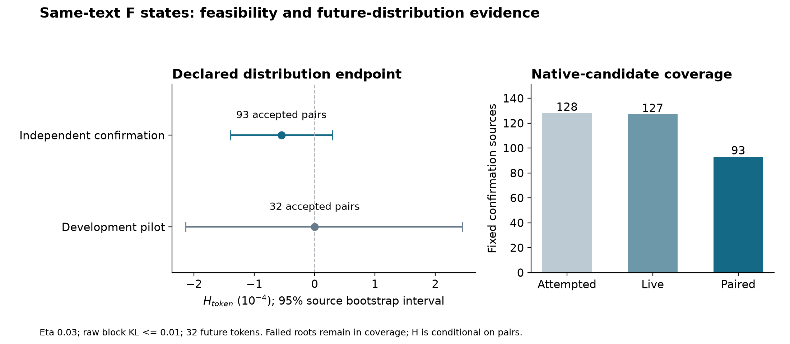

# Idea 001: Native same-text states in CoLa

## Conclusion

**Strict same-text, effectively distinct native continuous states are
constructible. The specified future marginal-distribution effect has no positive
support; the route task provides no usable reward signal.** Candidate feasibility
is an established positive result, and the core F distribution observable has
completed independent measurement. This is materially different from the original
P0 state, where qualified starting points were unavailable.

Close the current execution scheme as a research-budget decision: the present
proposal, observable, and route setting do not provide enough positive evidence
for further investment. R4 is a completed measurement with an unsupported effect;
R5 remains weakly informative because of its task-reward floor. Neither establishes
that all possible gains are zero. Preserve the shared tools and keep the no-training
decision. See the [closing user audit](../reviews/FINAL_REVIEW_4922a00.md).

This completes the adopted no-training study: R0-R4 and the bounded R5 development
probe ran to their specified limits. The evidence did not activate cache
localization, large R5 reward confirmation, or the equal-cost utility study.
Those stages are explicitly unexecuted, rather than reported as passing.

## What was tested

The released CoLa checkpoint remained frozen. Source revision is
`7d1daeea1455a6cb9e23ddd4f06b8a2e59e63a8c`; checkpoint revision is
`c1eafdd9cfd8064aeb917d569ef70a075b353eed`. Native mechanism runs used 16 Euler
steps, CFG 7, greedy decoding, repetition penalty 1, and 16-position DiT blocks.
The official capability comparison separately used its pinned official decoding
conditions, including repetition penalty 1.1.

F changes a fully generated block. M changes the first mixed block while keeping
known prompt latents fixed. Proposals perturb the original block noise and rerun
the native sampler; both decoder and DiT histories receive the same resulting
latent. Candidates must preserve all emitted token IDs, satisfy raw symmetric
KL sum <=0.01 and maximum-position KL <=0.0025, and remain effectively distinct.
Eta=0.03 was chosen on development feasibility, without future rewards. K is at
most two; failed proposals and reference-only fallbacks are retained.

F completed the natural-text distribution pilot and independent confirmation.
M completed feasibility validation and the small Branch-M reward probe; M did
not receive an equivalent natural-text distribution confirmation.

The source-document continuation study uses independent development and
confirmation articles. For fixed candidate sets, A and B future noises are
independent between splits and shared across candidates within each split.
The primary H_token estimates variation in token-position probability vectors
over a 32-token future. For K=2 its population target is half their mean squared
L2 distance. Single common-noise suffix differences measure a coupling, not this
marginal distribution difference. Signed finite-sample H estimates are preserved.
The conditional confirmation mean uses 93 accepted source pairs; the 34 reference
fallbacks contribute coverage and cost, not two-state heterogeneity observations.

## Completed evidence

| Study | Observed result | Interpretation |
| --- | --- | --- |
| R0 saved-route audit | All 1,024 historical outputs and scores reproduced | Preserve the original failures; separate F geometry from possible M anchors |
| R1 official capability | LAMBADA 63/128; SQuAD 43/128; eight exact paired inference/replay checks | The frozen model and wrapper have nonzero official-task capability |
| R2 matched route diagnostics | Copy 3/64; Chain, Branch, Matched-full each 0/64 | The route tasks remain a poor task-value substrate |
| R3 development feasibility | 32 F pairs from 45 sources; 32 M pairs from 41 sources | Strict same-text native alternatives exist; adaptive collection coverage is descriptive |
| R4 independent feasibility | 93/128 fixed sources yield pairs (72.7%); 34 fallbacks; one terminated anchor | Candidate feasibility is established on fresh sources |
| R4 distribution confirmation | Conditional mean on 93 accepted pairs /128 attempts: H_token=-0.00005513; 95% source interval [-0.00013951, 0.00002952] | No positive H1a support for the declared setting and observable |
| R5 bounded Branch-M probe | 8/8 accepted pairs; reference 0/64 and alternative 0/64 successful futures | No observed task-value headroom; H_reward=0 and G=0 at a reward floor |

The capability scores are fixed 128-item subsets, not reproductions of the full
published benchmarks. The SQuAD metric follows the pinned released scorer and
supplied gold string, rather than claiming the canonical multi-answer evaluator.
The four route cells alter several requirements, so their comparison does not
identify a single causal difficulty factor.

Branch's canonical common trunks contain only 8-14 tokens and have no predecision
full 16-token F block. Its missing F roots therefore cannot be attributed solely
to model competence. Independently, only 6/64 samples have a correct first edge,
and none reaches the first branch after the correct trunk. The bounded M probe
uses all eight existing eligible roots on four graphs; its anchors contain only
one or three generated tokens. It is not a long-trunk planning intervention.

See [R0](R0_REPORT.md), [R1](R1_REPORT.md), [R2](R2_REPORT.md),
[R3](R3_REPORT.md), [R4 confirmation](R4_CONFIRMATION_REPORT.md), and
[R5 development probe](R5_PROBE_REPORT.md) for definitions, detailed funnels,
provenance, and limitations. [Raw same-prefix examples](SAME_PREFIX_EXAMPLES.md)
retain exact shared token IDs, latent displacement, and paired suffixes.

## Distribution and value are separate findings

The 32-pair F pilot had H_token=0 with a 95% interval
[-0.00021362, 0.00024414]. Independent confirmation used eight A and eight B
samples per live root and completed 3,520 futures. Its interval is narrower but
still includes zero. Meanwhile, 807/1,488 common-noise suffix pairs differ, with
mean token-position disagreement 0.102025. Those differences are real realized
outputs; they do not establish different marginal future distributions. The
807/1,488 disagreement rate is 54.2%, compared with 10.2% mean position disagreement.

The confirmation does not prove universal text-state sufficiency. Its conclusion
is limited to this checkpoint, native proposal setting, accepted F pairs,
32-token horizon, and token-position observable. Joint sequence structure,
other horizons, and other proposal mechanisms remain outside the tested claim.
The interval is not a practical-equivalence result: no mapping from this squared
L2 scale to task success or semantic importance has been established.

The Branch-M probe completed 128 futures and rescored all stored answers with
public graph constraints. Only 42/128 are parseable, and every parseable answer
fails the listed-road condition. All A rewards tie, selecting the reference;
independent B gain is zero. With four graph groups and all-zero rewards, the
empirical bootstrap is degenerate. Its [0,0] output is not a valid population
zero bound; the reports mark the interval unavailable. H1b/H2 are unsupported
and poorly constrained by this task floor, not universally refuted.

## Costs and stage decisions

Fixed-source pair yield is 93/128=72.7%, while overall proposal acceptance is
93/1,520=6.1%. Constructibility alone does not establish efficient search.
The independent F confirmation charges 1,520 proposals, including 256 same-token
KL rejections, and all 3,520 futures including fallbacks. Construction costs
2,813.21 summed worker-seconds; future inference and replay cost 11,151.97 seconds.
Total per-root work is 13,965.73 seconds (3.879 worker-hours), with 59.87 minutes
from launch to the last exit across four RTX A6000 GPUs. Development calibration,
collection, and pilot costs are additional and retained in their reports.
The Branch-M probe costs 433.59 summed worker-seconds. These are measured research
costs; no equal-cost performance comparison has been run.

| Remaining stage | Final disposition |
| --- | --- |
| Eight-root cache-path diagnostic | Not activated: neither pilot nor confirmation supports the positive-effect trigger; zero diagnostic GPU trajectories |
| Large R5 reward confirmation | Not activated: the bounded development probe has no observed conditional reward headroom |
| Equal-cost H3 study and cost curves | Not run: there is no supported selection gain to justify the utility comparison |
| LoRA and learned selector training | Outside the adopted no-training scope; no training run |
| Original human-reviewed transfer study | Deferred by the revised protocol; natural continuation is not a substitute factuality evaluation |

## Research decision and reusable outcome

The engineering bottleneck is resolved. Official inference parity, chronological
cache reconstruction, native M/F conditioning, candidate serialization, and
independent A/B execution pass their relevant checks. Candidate feasibility is
also established. The remaining bottlenecks are scientific: the strict proposal
has no supported positive effect on the declared distribution observable, and
the route task gives insufficient reward signal for a selection study.

Retire the current route family as the main task for state-value and selection
measurement with this frozen checkpoint. Lowering a success threshold does not
resolve its capability mismatch; removing road validity changes the task.

The [official answer-position audit](r0_official_answer_positions_v1.json) finds
only one LAMBADA and 15 SQuAD gold answers crossing the first mixed boundary
in the fixed 128-item subsets. These counts precede natural-prefix correctness,
unfinished-answer, and candidate requirements. They are not available-root counts
or sufficient justification for a new large study. A future task should first
show measurable conditional reward variation after its native boundary.

Keep the frozen state engine, configurable native proposals, paired-future
measurement, source/graph aggregation, and experiment records. Stop further
budget expansion on the present route-value floor. A future idea should first
identify a native task with measurable conditional reward within the frozen
model's capabilities, or state a distinct observable/proposal hypothesis. It
should not reopen this run through outcome-dependent top-ups or training. Any
new study needs a distinct, explicit hypothesis and a rationale for its task,
observable, or proposal. A possible bounded saved-continuation sequence analysis
would be post hoc and exploratory; it has not been run and could not overwrite
the original R4 confirmation conclusion.

The primary repository and all large artifacts remain on nebula; Git tracks
code, configurations, compact results, and reports. Full commands and frozen
run commits are in [jobs/jobs.jsonl](../../../jobs/jobs.jsonl); formal facts are
in [experiments/results.tsv](../../results.tsv). The supplied audit and its
[adoption record](../reviews/ADOPTION.md) remain distinct from measured evidence.
