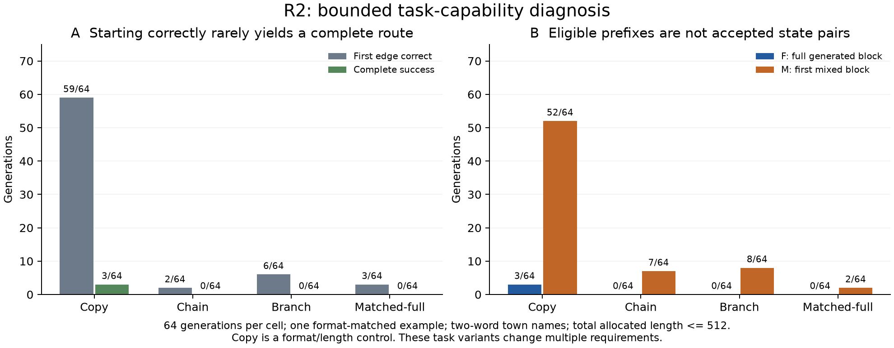

# Bounded route diagnosis

Generation commit `8e2ab3f`; all four workers completed with all 64 required
(task, repeat) observations per cell. See [first three cells](r2_first_three_v1.json)
and [Matched-full](r2_matched_full_v1.json).

| Cell | Complete success | Parseable | First edge correct | Eligible M | Eligible F |
| --- | --- | --- | --- | --- | --- |
| Copy | 3/64 | 44/64 | 59/64 | 52/64 | 3/64 |
| Chain | 0/64 | 40/64 | 2/64 | 7/64 | 0/64 |
| Branch | 0/64 | 34/64 | 6/64 | 8/64 | 0/64 |
| Matched-full | 0/64 | 28/64 | 3/64 | 2/64 | 0/64 |

Copy usually starts along the supplied chain but rarely sustains all 10-12
towns. Chain and Branch struggle before the first completed generated block.
No Branch sample reaches its first branch after a correct common trunk, so
these outputs do not diagnose the choice between the valid and bypass arms.
Together with Matched-full, they provide no eligible native F reward roots
for a non-Copy route task.

These cells use the same two-word naming convention and one concise format-
matched demonstration, but change multiple task requirements. Do not attribute
the differences to one causal factor or claim that a particular demonstration
change caused improvement over P0. Copy is a format/length control and is not
a task-value candidate cohort under the active protocol.

Intervals in the compact results cluster renamed isomorphic graph instances.
Copy and Chain have only three underlying chain lengths, limiting inference
beyond the tested layouts. All-zero reward bootstraps for Chain/Branch are
marked degenerate; a [0, 0] resampling interval is not a population zero bound.
No inference about H1a follows from this reward floor.

Summed generation worker times were 932.85 s, 929.31 s and 931.37 s. All requested
128-token horizons were block-rounded and charged, including generation after
the first answer terminator. The largest allocated context across the complete
static R2 data was 464 positions; no task was excluded for length.

Decision: continue the independent natural F distribution study. Preserve M
prefix opportunities without treating them as accepted candidate pairs or
useful reward control. R2 is complete. There are 17 potential M prefixes across the three non-Copy
cells, but no successful reference routes or measured native candidate value.
All-zero reference reward does not rule out a beneficial alternative. R5 is not
activated by these observations; this is a task-coverage limitation, not evidence
against H1b/H2. Do not train to rescue the route task.

Matched-full generation cost 940.14 worker-seconds; all four cells together used 3,733.67 worker-seconds for 256 generations.

## Intended-format boundary audit

A CPU reconstruction of the saved task layouts separates intended-format
availability from observed model prefixes. Copy, Chain and Matched-full each
have a canonical pre-decision F boundary on all 32 tasks. Branch has none:
its common trunk contains only 8-14 tokens, shorter than a full generated block.
It has a canonical M opportunity on 26/32 tasks. See the
[layout records](r2_canonical_layouts_v1.json).

Thus Branch's zero observed F roots cannot be attributed solely to model
competence. The separate facts that only 6/64 first edges are correct and no
sample reaches a branch after the correct trunk still describe a capability
limitation. Use M for the bounded Branch value probe; do not add filler or a
gold prefix to manufacture F availability. The eight selected M roots' valid
answers span 18-27 tokens; the full R2 Branch set spans 18-30 in its supplied
canonical solutions.
